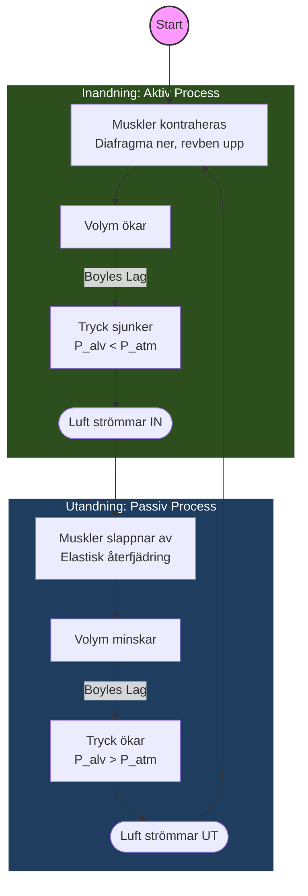

```mermaid

graph TD

    %% Nodes and Styles

    Start((Start))

    subgraph IN[Inandning: Aktiv Process]

        direction TB

        M_In[Muskler kontraheras<br/>Diafragma ner, revben upp]

        V_In[Volym ökar]

        P_In[Tryck sjunker<br/>P_alv < P_atm]

        Flow_In([Luft strömmar IN])

    end

  

    subgraph UT[Utandning: Passiv Process]

        direction TB

        M_Out[Muskler slappnar av<br/>Elastisk återfjädring]

        V_Out[Volym minskar]

        P_Out[Tryck ökar<br/>P_alv > P_atm]

        Flow_Out([Luft strömmar UT])

    end

  

    %% Connections

    Start --> M_In

    M_In --> V_In

    V_In -- Boyles Lag --> P_In

    P_In --> Flow_In

    Flow_In --> M_Out

    M_Out --> V_Out

    V_Out -- Boyles Lag --> P_Out

    P_Out --> Flow_Out

    Flow_Out --> M_In

  

    %% Styling for better visibility in Obsidian dark/light mode

    style IN fill:#2d4f1e,stroke:#fff,stroke-width:2px,color:#fff

    style UT fill:#1e3d5f,stroke:#fff,stroke-width:2px,color:#fff

    style Start fill:#f9f,stroke:#333,stroke-width:2px,color:#

  

```
