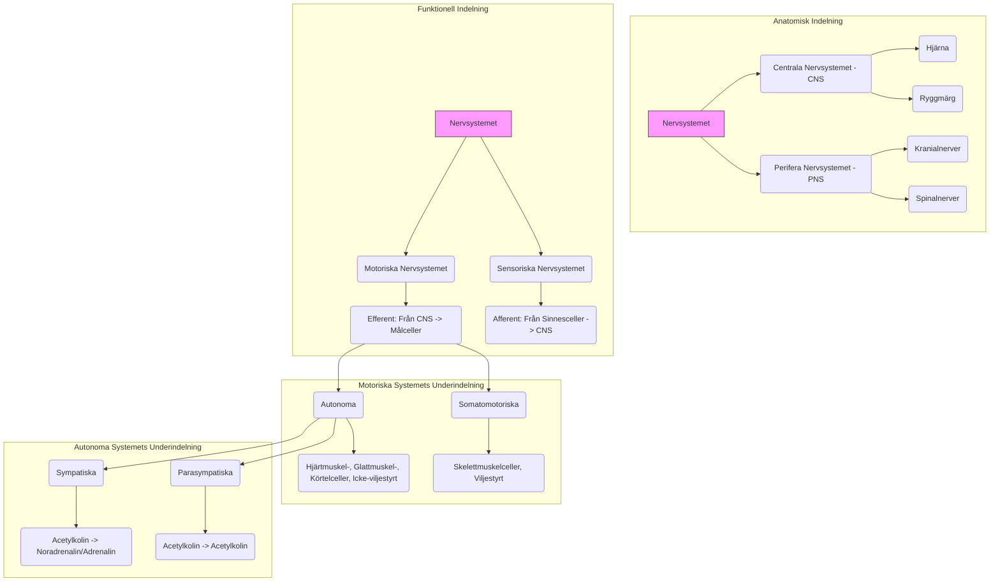

```mermaid
flowchart TD
    subgraph Anatomisk Indelning
        A[Nervsystemet] --> A1(Centrala Nervsystemet - CNS);
        A1 --> A1a(Hjärna);
        A1 --> A1b(Ryggmärg);
        A[Nervsystemet] --> A2(Perifera Nervsystemet - PNS);
        A2 --> A2a(Kranialnerver);
        A2 --> A2b(Spinalnerver);
    end

    subgraph Funktionell Indelning
        F[Nervsystemet] --> F1(Sensoriska Nervsystemet);
        F1 --> F1a(Afferent: Från Sinnesceller -> CNS);
        F[Nervsystemet] --> F2(Motoriska Nervsystemet);
        F2 --> F2a(Efferent: Från CNS -> Målceller);
    end

    subgraph Motoriska Systemets Underindelning
        F2a --> M1(Somatomotoriska);
        M1 --> M1a(Skelettmuskelceller, Viljestyrt);
        F2a --> M2(Autonoma);
        M2 --> M2a(Hjärtmuskel-, Glattmuskel-, Körtelceller, Icke-viljestyrt);
    end

    subgraph Autonoma Systemets Underindelning
        M2 --> S1(Parasympatiska);
        S1 --> S1a(Acetylkolin -> Acetylkolin);
        M2 --> S2(Sympatiska);
        S2 --> S2a(Acetylkolin -> Noradrenalin/Adrenalin);
    end

    style F fill:#f9f,stroke:#333
    style A fill:#f9f,stroke:#333
```