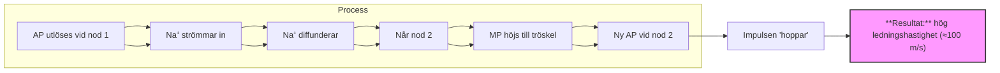

# Påbyggnadsuppgifter knutna till Inlärningsträff 4 utan svar

Fråga 1: Vad är det latinska namnet på följande strukturer. 1

- **A)** Platsen för det motoriska minnet: Cerebellum. Ligger inferiort om nackloben. Avgörande för motorisk koordination, balans och lagring av muskelminne.
    
- **B)** Storhjärnan (två olika namn eftersöks): Cerebrum. Största delen av hjänan som avansvarär för högre funktioner. Sinnesuppfattning, viljestyrd motorisk, intellekt.
    
- **C)** Den del av hjärnstammen, som är i direktkontakt med ryggmärgen: Medulla oblongata. Mest inferiort delen av hjärnstammen som övergår direkt i ryggmärgen. Centrum för andning och cirkulation.
    
- **D)** Den yttersta hjärnhinnan: Dura mater. Hårda fibrösa yttersta lagret av hjärnhinnan. Skydd
    
- **E)** Ansamlingen av spinalnerver från ryggmärgens nedersta delar: Cauda equina (L 2-S 5. Co1)
    

> [!NOTE] Svar 1

---

### Fråga 2: Nervceller kan grupperas på olika sätt, t.ex. efter utseende. Ett annat sätt att gruppera nervceller är efter vilken funktion de har. Här talar man om tre olika typer, sensorisk nervcell, interneuron och motorisk nervcell.

Vad är skillnaden i funktion, mellan dessa tre typer av nervceller? 7

> [!NOTE] Svar 2
> 1. Sensoriska (afferenta). Deras funktion är att detektera förändringar i den inre eller yttre miljö via receptor. Här oftast unipölära eller bipölara för struktur. Signal- skickar aktionspotentialer mot det CNS
> 2. Interneuron. Funktion- integration och bearbetning. Analyserär sensorisk information och bestämmer lämplig motorisk respons. De bildär komplexa nätverk för minne och kognition. Struktur- oftast multipolära. Ligger iniuti CNS, 99% av alla nervceller är interneuron.
> 3. Motorisk(Efferenta)- Funktion- Exekvering. De bär kommando signaler från CNS till effektorer (målcellen). Finns 2 typer; [[Somatomotoriska]] och [[Autonoma]]. Signal- Skickär aktionspotential från [[CNS]] ut i kroppen

---

Fråga 3: Varför kan en skada på höger hjärnhalva leda till en oförmåga att stimulera kontraktion av skelettmuskelceller i t.ex. vänster hand, men inte höger hand? 8

> [!NOTE] Svar 3
> nervbanor som styr våra viljestyrd rörelser korsär kroppens medellinje på vägen från hjänan till ner ryggmärgen. Höger hjärnhalva styr vänster kroppshalva och vice versa,
> Mekanism; Pyramidbanekrosningen. (Decussation)
> Signaler för viljestyrd motorisk startar i den primära motorbarken i pannloben. axoner från dess övre motorneuron färdas ned genom hjärnstammen. I medulla oblongata korsar majoriteten av dessa motoriska nervtrådar över till den motsatta sidan. 

---

### Fråga 4: Hos en somato-motorisk nervcell (nervcellerna som stimulerar våra skelettmuskelceller) kan en aktionspotential genereras i axonhalsregionen, vilket avslutningsvis leder till att neurotransmittorer utsöndras i synapsspalten.

Redogör för de olika stegen i denna process utifrån följande punkter: 9

- **A)** Hur skapas aktionspotentialen i axonhalsen? 
    
- **B)** Hur fortleds nervimpulsen längs det myeliniserade axonet till axonterminalen? 
    
- **C)** Vad sker i axonterminalen när aktionspotentialen når dit och hur leder detta till att neurotransmittorer utsöndras? 
    

_Använd 3-5 meningar per steg._ 13

> [!NOTE] Svar 4
> A) nervcellen tar emot stimulerande och hämmande signaler via sina dendriter och cellkropp. Dessa summeras vid axonhalsen, om summan av signaler leder till att membranpotentialen depolariseras tillräckligt mycket (-60 mV) startar en kjedereaktion, öppnas spänningsreglerande Na+ kanaler lerder till massivt inflöde av Na+ joner. Ändras membranpotentialen till +30mV(depolariseras), därefter öppnas K+ för att återfå negativa laddningen. Denna snabba spänningsförändring är nervimpulsen.
> B) Aktionspotential transporterats längs axonet för att nå målet. Myeliniserade nervceller sker detta genom saltorisk fortledning. Myelinskidorna är isolering som förhindrar joner läckas ut; tvingar signaler att färda inuti axonet. mellan myelinskidorna finns osiolade mellarum som heter ranviers noder där spänningsreglerande jonkanaler är komcenterande.'

---

### Fråga 5: Vid sjukdomen Multipel skleros (MS) kommer myelinskidorna i det centrala nervsystemet att skadas, troligtvis genom att kroppens eget immunförsvar attackerar aktuella strukturer. Vad händer med fortledningshastigheten av nervimpulser hos aktuella axoner då dessa förlorar myeliniseringen?

Motivera ditt svar. 14

> [!NOTE] Svar 5

---

### Fråga 6: Nervceller hämmar stimuleringen av andra nervceller genom att påverka membranpotentialen hos den mottagande nervcellen.

Hur gör den det med hjälp av neurotransmittorer? 15

> [!NOTE] Svar 6

---

### Fråga 7: Parathormon (PTH) tillverkas i bisköldkörtlarna och har bland annat förmågan att aktivera osteoklaster i kroppen. Vid ett sjukdomstillstånd som kallas hyperparatyreos, utsöndras större mängder PTH än normalt från bisköldkörteln. Vilken effekt bör detta få på mängden benvävnad i kroppen?

Hur kommer detta att kunna påverka mängden $Ca^{2+}$ i blodet? 16

> [!NOTE] Svar 7

---

### Fråga 8: Aktiveringen av en skelettmuskelcell inleds med att neurotransmittorn acetylkolin binder till och öppnar jonkanaler på det postsynaptiska membranet i den neuromuskulära synapsen.

Beskriv hur detta i sin tur leder till att den cytosola koncentrationen av $Ca^{2+}$ i skelettmuskelcellen ökar kraftigt. 17

> [!NOTE] Svar 8

---

### Fråga 9: Hur skulle frånvaro av Troponin påverka skelettmuskelcellens förmåga till kontraktion?

Motivera ditt svar. 18

> [!NOTE] Svar 9

---

### Fråga 10: Beskriv den ATP-beroende process som leder till att sarkomeren förkortas.

Inled beskrivningen när myosinhuvudet sitter inbundet till aktinfilamentet, utan att ATP är inbundet. 19

> [!NOTE] Svar 10

---

### Fråga 11: Kort efter det att en person avlider utvecklas vad man brukar kalla likstelhet (rigor mortis).

Förklara hur detta tillstånd uppstår. 20

> [!NOTE] Svar 11

---

### Fråga 12: Redogör detaljerat för hur 38 ATP skapas vid den fullständiga oxidationen av glukos i en människocell.

Inkludera information kring det övergripande resultatet av de olika delreaktionerna, samt deras lokalisation i cellen. 21

Observera att svars utrymmet är mer omfattande denna gång, jämfört med när en liknande fråga var med på en tidigare inlärningsträff. Därmed förväntas mer detaljer inkluderas i det svar du ska rita och skriva nu till denna inlärningsträff. 22

> [!NOTE] Svar 12

---

### Fråga 13:

**A)** Vad är det latinska namnet på en muskel som kan utföra flexion på armbågsleden? 23**B)** Vad är det latinska namnet på en muskel som kan utföra extension på armbågsleden? 24

> [!NOTE] Svar 13
> 
> A:
> 
> **B:**

---

### Fråga 14: Cigarettrökning kan leda till en ökad risk att drabbas av infektioner i luftvägarna.

Ge en förklaring till detta fenomen. 25

> [!NOTE] Svar 14

---

### Fråga 15: Beskriv drivkrafterna som leder till att luft flödar in respektive ut ur lungorna.

Inkludera information om vad det är som är med och skapar aktuella drivkrafter under viloförhållanden. 26

> [!NOTE] Svar 15

---

Fråga 16: Beskriv hur transporten av syre $(O_{2})$ från lungornas alveoler (lungblåsor) till cellerna i kroppens olika vävnader sker. 27

> [!NOTE] Svar 16

---

### Fråga 17: För att undersöka en persons andningsfunktion kan partialtrycket av syrgas respektive koldioxid mätas i blodet. Ett allt för lågt syrgastryck och ett allt för högt koldioxidtryck är en indikation på en nedsatt andningsfunktion.

Från vilken typ av blodkärl bör man tappa blod för att få en så god bild som möjligt av andningsfunktionen? 28

> [!NOTE] Svar 17

---

Fråga 18: Beskriv hur koldioxid transporterats från cellerna i kroppens olika vävnader till lungornas alveoler. 29

> [!NOTE] Svar 18

---

### Fråga 19: Då en person hyperventilerar ("andas för mycket") kan större mängder koldioxid $(CO_{2})$ än önskvärt andas ut.

Hur kommer detta potentiellt påverka pH-värdet i blodet? 30

> [!NOTE] Svar 19

---

### Fråga 20: Vad är det latinska namnet på...

**A)** Strukturen, som luften passerar mellan näshålan och struphuvudet? 31**B)** Den del av luftvägarna, som ligger mellan svalget och luftstrupen och där man hittar stämbanden? 32**C)** Den struktur, som blockerar passagen ned till de nedre luftvägarna när en person sväljer? 33**D)** Den struktur, som inandningsluften når efter struphuvudet? 34**F)** Den nerv, som stimulerar mellangärdesmuskeln (M. diaphragma) att kontrahera, vars namn på svenska är mellangärdesnerven? 35

> [!NOTE] Svar 20
> 
> A: