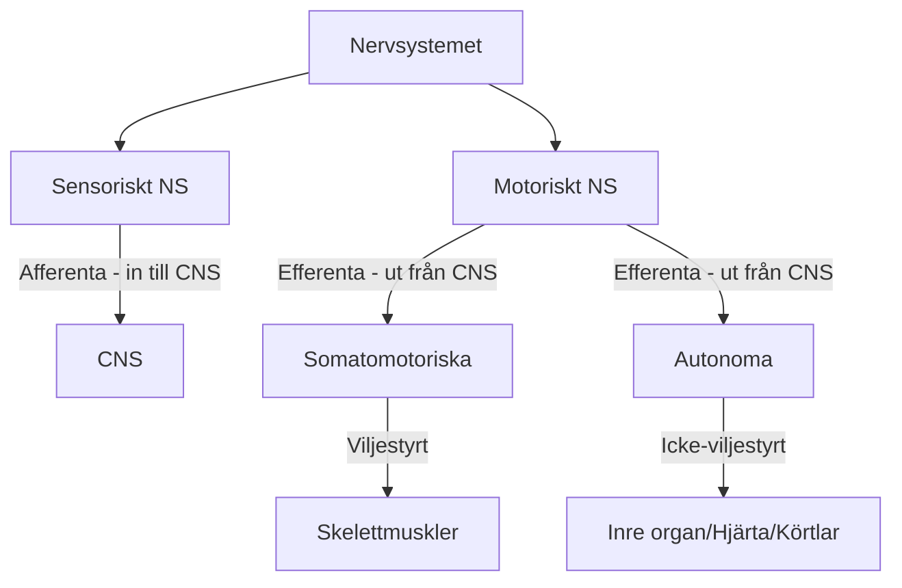

# Anatomi och Fysiologi: Nervsystemet & Rörelseorganet

---

## 🧠 Del 1: Nervsystemets Anatomi och Fysiologi

### 📂 Anatomisk Indelning

> [!SUMMARY] Översikt
> Det centrala nervsystemet skyddas av benstrukturer och tre hinnor.

#### 1. Centrala Nervsystemet (CNS)
* **Hjärnan:** Över 120 miljarder nervceller.
* **Ryggmärgen (Medulla spinalis):**
    * Över 10 miljoner nervceller.
    * Slutar vid kotnivå **L2**.

#### 2. Perifera Nervsystemet (PNS)
* **Kranialnerver:** 12 par (utgår från hjärnan).
* **Spinalnerver:** 31 par (utgår från ryggmärgen).

---

### ⚙️ Funktionell Indelning

graph TD
    A[Stimulering når -60mV] -->|Na+ kanaler öppnas| B[Depolarisering]
    B -->|Na+ strömmar in| C[Potential stiger till +30mV]
    C -->|Na+ stänger, K+ öppnas| D[Repolarisering]
    D -->|K+ strömmar ut| E[Potential faller till -70mV]
    E --> F[Vilo-fas]
    

|**Hjärndel**|**Funktion**|
|---|---|
|**Storhjärnan (Cerebrum)**|Sinnesuppfattning, minne, intellekt, språk, vilja.      _(Motorisk bark: muskler. Somatosensorisk bark: känsel)._|
|**Mellanhjärnan (Diencephalon)**|**Talamus:** Omkoppling för sensoriska banor (ej lukt).      **Hypotalamus:** Kontroll av ANS, länk till endokrina (Hypofysen), temp-centrum.|
|**Mitthjärnan (Mesencephalon)**|Del av hjärnstammen, reflexer.|
|**Bryggan (Pons)**|Cirkulation, andningscentrum.|
|**Förlängda Märgen (Medulla obl.)**|Styr andning och cirkulation.|
|**Lillhjärnan (Cerebellum)**|Motorisk koordination, "jämför" rörelser, motoriskt minne (cykla).|
|**Ryggmärgen**|Förbindelse till PNS (spinalnerver).|

|**Egenskap**|**Parasympatiska ("Rest & Digest")**|**Sympatiska ("Fight or Flight")**|
|---|---|---|
|**Funktion**|Sänker puls, ökar mage/tarm, drar ihop pupill.|Ökar puls, vidgar luftvägar, minskar tarm, vidgar pupill.|
|**Preganglionär cell**|Lång|Kort|
|**Postganglionär cell**|Kort (nära målcell)|Lång (nära CNS)|
|**Neurotransmittor**|Acetylkolin (båda synapser)|Acetylkolin $\rightarrow$ Noradrenalin|
|**Binjuremärgen**|-|Stimulerar utsöndring av Adrenalin.|

graph TD
    Muskel[Skelettmuskel] --> Fiber[Muskelfiber / Cell]
    Fiber --> Myofibrill[Myofibrill]
    Myofibrill --> Sarkomer[Sarkomer]
    Sarkomer --> Aktin[Aktinfilament - Tunna]
    Sarkomer --> Myosin[Myosinfilament - Tjocka]