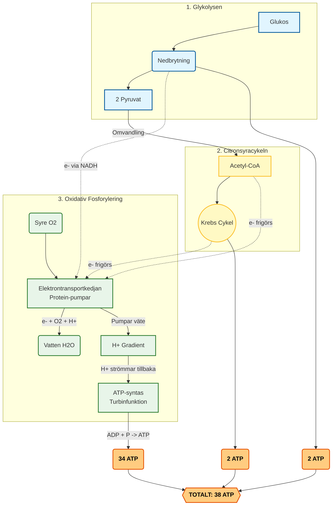

```mermaid
graph TD
    %% --- STYLING ---
    classDef glu fill:#e1f5fe,stroke:#01579b,stroke-width:2px;
    classDef cac fill:#fff9c4,stroke:#fbc02d,stroke-width:2px;
    classDef ox fill:#e8f5e9,stroke:#2e7d32,stroke-width:2px;
    classDef atp fill:#ffcc80,stroke:#e65100,stroke-width:2px,color:#000,font-weight:bold;
    classDef electron fill:#f3e5f5,stroke:#7b1fa2,stroke-dasharray: 5 5;

    %% --- STEG 1: GLYKOLYSEN ---
    subgraph S1 [1. Glykolysen]
        direction TB
        G[Glukos]:::glu
        Process1(Nedbrytning):::glu
        Pyr[2 Pyruvat]:::glu
    end

    %% --- STEG 2: CITRONSYRACYKELN ---
    subgraph S2 [2. Citronsyracykeln]
        direction TB
        ACoA[Acetyl-CoA]:::cac
        Cycle((Krebs Cykel)):::cac
    end

    %% --- STEG 3: OXIDATIV FOSFORYLERING ---
    subgraph S3 [3. Oxidativ Fosforylering]
        direction TB
        ETC[Elektrontransportkedjan<br/>Protein-pumpar]:::ox
        O2(Syre O2):::ox
        H2O(Vatten H2O):::ox
        Grad[H+ Gradient]:::ox
        Turbin[ATP-syntas<br/>Turbinfunktion]:::ox
    end

    %% --- ATP SUMMARING ---
    ATP_G(2 ATP):::atp
    ATP_C(2 ATP):::atp
    ATP_O(34 ATP):::atp
    TOTAL{{TOTALT: 38 ATP}}:::atp

    %% --- FLÖDEN ---
    
    %% Kol-flödet (Substans)
    G --> Process1 --> Pyr
    Pyr -->|Omvandling| ACoA --> Cycle

    %% Elektron-flödet (NADH/FADH2)
    Process1 -.->|e- via NADH| ETC
    ACoA -.->|e- frigörs| ETC
    Cycle -.->|e- frigörs| ETC

    %% Oxidativ process
    O2 --> ETC
    ETC -->|e- + O2 + H+| H2O
    ETC -->|Pumpar väte| Grad
    Grad -->|H+ strömmar tillbaka| Turbin

    %% ATP Produktion
    Process1 --> ATP_G
    Cycle --> ATP_C
    Turbin -->|ADP + P -> ATP| ATP_O

    %% Sammanställning
    ATP_G --> TOTAL
    ATP_C --> TOTAL
    ATP_O --> TOTAL

    %% Länkar för layout (osynliga för styrning)
    S1 ~~~ S2 ~~~ S3
```
